Continuum Reporting
======

**Ryan Larson & Kate Perry**

---
## Table of Contents

[Executive Summary](#Executive-Summary)

[Methodology](#Methodology)

[Desirability](#Desirability)

[Framing the Concept](#Framing-the-Concept)

[Data](#Data)

[Prototypes](#Prototypes)

[Next Steps](#Next-Steps)

[Sources](#Sources)

---
## Executive Summary

Right up to applying for college, high school students have a very unique relationship with ACT relative to any other source of guidance they have on their side.  ACT is a trusted, objective resource intended to provide students with an accurate gauge of academic abilities and projected success in college.  However, the ACT assessment is a single-point interaction that often does not leave students with actionable insights or hints on next steps to take. 

Currently, students provide ACT with a trove of information about themselves (both cognitive and non-cognitive) and, in return, receive essentially a green or red light to continue on their projected path to college.  We question how helpful this static information can really be to students, especially in the case of a red light.  Instead of simply giving students an “X,” ACT would best serve their most important customers by helping them to realize a new direction.

By putting the information students have already provided ACT to use, we believe that ACT has an excellent opportunity to provide students with the ability to dynamically explore their own interests and abilities and to guide themselves through the college decision making process.

---

Before applying to college, there are three major questions that students need to answer. The following questions will serve as a starting point for the rest of our work:
1. “*What do I want to do?*”
2. “*Where can I do it?*”
3. “*How would I do it?*”

Currently, there are three interactive prototypes already in development at ACT that can help answer these questions respectively:
1. **Major Map**: displays a scatter plot of majors mapped on scales of academic and interest fits.
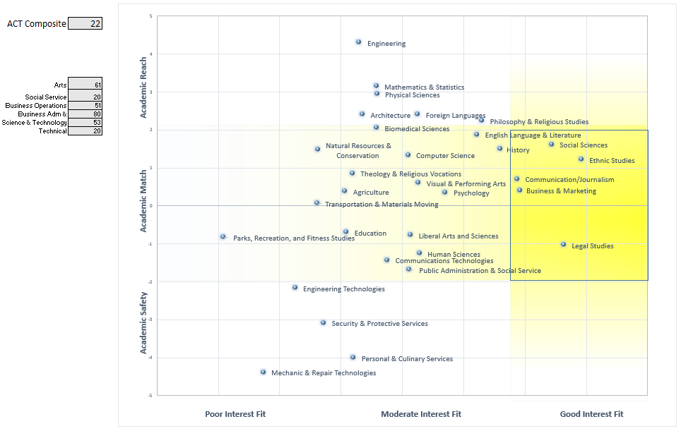
2. **College Recommender**: outputs colleges that students similar to the user also sent their scores.
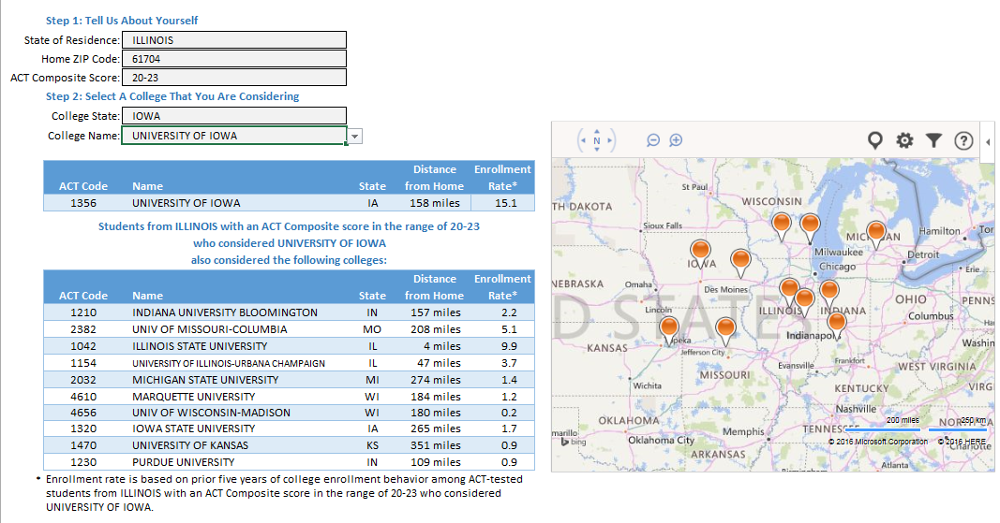
3. **Probability Guages**: measures three probabilities of success in different majors, including the student’s likelihood of…
    - Earning a 3.0 GPA (a “B” average) in their first year
    - Returning to that major for a second year
    - Graduating with that degree in four years
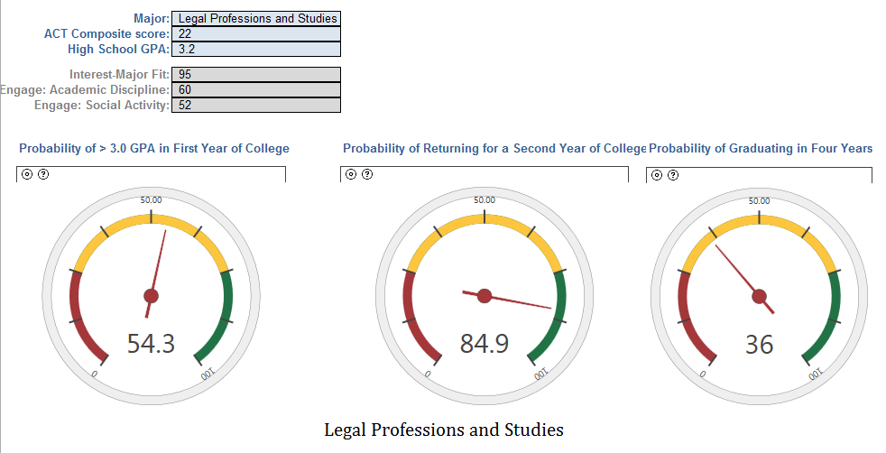
    
Separately, these prototypes offer useful information to students.  However, incorporating these three prototypes into one interactive tool will provide students the space and opportunity to discover powerful insights as they search for their next steps.  We intend to make this tool interactive so that students can explore their options freely.  Interactivity will also allow the students to feel like they come upon their decisions independently, which will create stronger ties to the conclusions they come to.

Through scenario building and instant feedback on their options as they explore, students can see a holistic view of themselves that we believe will help students identify majors that they are confident in pursuing and colleges that they will apply to.

---
## Methodology

In order to structure our research and solution development, we followed IIT ID’s Design Thinking framework, as outlined in Vijay Kumar’s 101 Design Methods.  For the most part, we followed these steps in order, allotting time for one stage a week.  However, the iterative and nonlinear nature of innovation allowed us the freedom to skip around in our innovation exploration. 

* **Sense Intent.** In this first stage, we worked to frame our problem through expert interviews and online research.

    *Insight*: Students need trusted guidance in identifying next steps after receiving ACT scores.
    

* **Know Context.** We narrowed our research topics to get to know what tools students already have from impersonal tools provided by the testing industry to personal advisors.  We also looked closely at what ACT already offers students, including the capabilities of Interest Inventory and ACT Profile.

    *Insight*: A multi-purpose online tool will be accessible to most students, and will allow students the freedom to explore their options in a safe space on their own terms.
    

* **Know People.** We identified our target users and got to understand their perspectives in determining next steps after taking the ACT through the research and persona work ACT has completed prior to initiation of this project.

    *Insight*: Students who know only part of what they want to do (either major or college) are the most likely to seek help and guidance on their college journey in contrast to students who are confident in both or completely lost in both.
    

* **Frame Insights.** We organized our research from previous stages in order to direct our efforts toward developing the most valuable and effective solution for target users.

    *Insight*: Students of varying perspectives with some idea of what their next steps should be will benefit from access to a diverse online tool that will provide decision support after receiving their ACT scores.
    

* **Explore Concepts.** We visualized and prototyped several solutions to address our problem.  We also looked for concepts already in development at ACT that were on the same track or attempting to add the same value.

    *Insight*: tudents have already shown interest in an integration of three prototypes previously developed by ACT that assess both a student’s cognitive and non-cognitive attributes in order to recommend majors, universities, and probabilities of success in college.
    

* **Frame Solutions.** We evaluated and combined several concepts in order to focus on one encompassing solution to pursue.

    *Insight*: Integrating several concepts and visualizations will help students develop a holistic frame of themselves that will guide them through their college decision making process.
    

* **Realize Offerings.** We developed a prototype of our integrated concept and planned for the next steps of the project.

    *Insight*: Our tool will direct students toward applying for viable colleges for them, and further development of this product should include implementation of planning tools to help students get there.

---
## Desirability

#### Primary Market

As they look for guidance through the college decision making process, students seek a personalized analysis of themselves that goes beyond their ACT score.  To accommodate this growing need, our design will take into account non-cognitive skills and interests that are measured in the Engage and Interest Inventory (taken with the ACT) assessments. 

To specify our target user, we are designing for students who have already taken both Engage and the ACT.  Furthermore, we elected to reference the Student Decision Making Life Cycle research initiated by the Business Innovation Factory in order to narrowly scope our target students.  This report categorizes students into four archetypes (Passionistas, Hunters, Gatherers, and Wanderers) that describe different college decision making processes.  We have identified two types of students that are most likely to use an interactive, exploratory tool:

1. **Hunters** “set their sights on a viable career path and narrowly aim for it” and “have a limited understanding of their individual skills.” These students need help broadening their list of colleges and majors by reflecting on their personal interests and strengths before they can confidently take the next steps towards a college education. 

2. **Gatherers** “will try out many options, but fail to commit to anything in particular.” These students need help narrowing their goals by measuring and comparing their interests before they can comfortably commit to any secondary educational path.

Both students need help verifying and finalizing their college decisions by either broadening or narrowing their goals.  Because of the stark contrast in the decision makers we are targeting, our challenge is to create a tool that is personalized and useful to a broad range of students without sacrificing usefulness for others.  This touch point is where getting to know the student through continuum reporting in ACT and Engage is very important.  Our tool is intended to add structure and personal guidance to both these decision making processes with respect to the user, not just our analytics process. 

#### Secondary Market

Mentors who are personally invested in the individual student’s future are strong candidates for secondary markets as they may be interested in or be able to help students draw insights from information given.  Parents and School Advisors will be the most likely to use this tool with students.

#### Value

The value of this tool relies completely on *what* students need and *when* they need it.  The decision making process, particularly for college, is iterative and often nonlinear, and where the student begins depends on the decision making archetype he or she fits into.

In the case of *Hunters*, students come into the college decision making process with one narrow goal in mind, whether it is a specific college, major, or both.  If their ACT score gives them a green light, they will run with their projected path.  However, if their ACT score shows that their abilities may not be able to take them to success, their perceived options drop to zero.  An interactive exploratory tool will help these students realize the existence of alternative paths, and the iterative process is intended to help discover insights into new interests and pursuits for them.

As for *Gatherers*, students begin with several interests and passions.  Regardless of whether their ACT light is red or green, they need help narrowing down their options by closely examining and experimenting with their interests in a non-committal environment.  These students will not have any trouble with the iterative process, and the structure that this tool will provide them will likely help them come to a conclusion faster than if they were just iterating the process in their minds.  An interactive exploratory tool will help these students connect their interests and abilities to find their passions, and help them find the right path to get there.

For both of these archetypes, the tool is meant to help broaden and narrow the list of students’ viable options repeatedly until, finally, they have concluded on a short list of colleges that they can confidently apply to.

As for the secondary market of Parents and Mentors, they will find value in the tool as their student finds independence in exploring their options, and in the information support as they are confident that their student is making an informed and responsible decision.

#### Benefit to ACT

In order for ACT to build and extend relationships with users, it needs to provide incentives for users to return to its products.  Because ACT’s target user base is made up of students on the path to college, we believe there is an excellent opportunity to use the data gathered from users in the ACT Score Report (including the Student Profile and Interest Inventory) and Engage, and ONET and Scorecard data to provide users with insights into areas they may find success in.  When ACT can help users draw connections between their products through continuum reporting, users see the value of providing further data to ACT.  In this way, the purchase of multiple ACT products and services is incentivized.

---
## Framing the Concept

Because our ultimate goal with this tool is to get students to apply to colleges, we wanted to explore what exactly makes a college recommendation “fit” with the student, and thus resonate enough to apply.  To visualize our thinking, we looked at the basic concept of a function.  It takes an input (the Domain), performs an operation (the Function, or “f”), and returns an output (the Range).

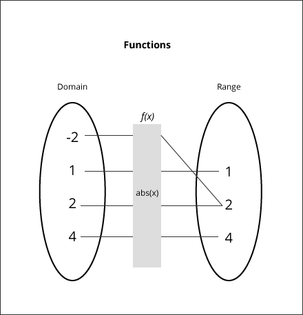

Likewise, in theory, we can take a set of inputs from a student (Attributes previously expressed to ACT by taking the ACT and Engage assessments) and put them through a “black box” function that compares student Attributes to the attributes of Ambitions (majors, colleges, or jobs).  This function will result in a list of Ambition Fits that can be ranked by closest match.  In order to figure out what that “black box” function does to produce Ambition Fits, we need to break down how students arrive at ambitions naturally.

Within the function’s input, or Student Attributes Domain (Figure 5), there are three categories of attributes: Environment, Capabilities, and Attitudes and Beliefs.  The spot at which all three overlap is where the Ambition lies.  We believe that, with the information already received from students, ACT has the opportunity to help students make connections between their Attributes, and match that to Ambition attributes.

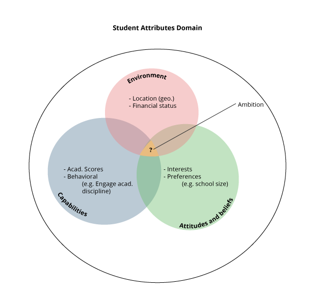

The real value of making connections between attributes comes to light in the recommendation process.  Many seemingly different careers (and majors and colleges), share attributes that aren’t obvious.  For example, school teachers and software developers are very separate career paths.  However, the common attribute between them is Lifelong Learning (see Figure 6).  For students, realizing those connections could bring a huge insight into their college decision making process.

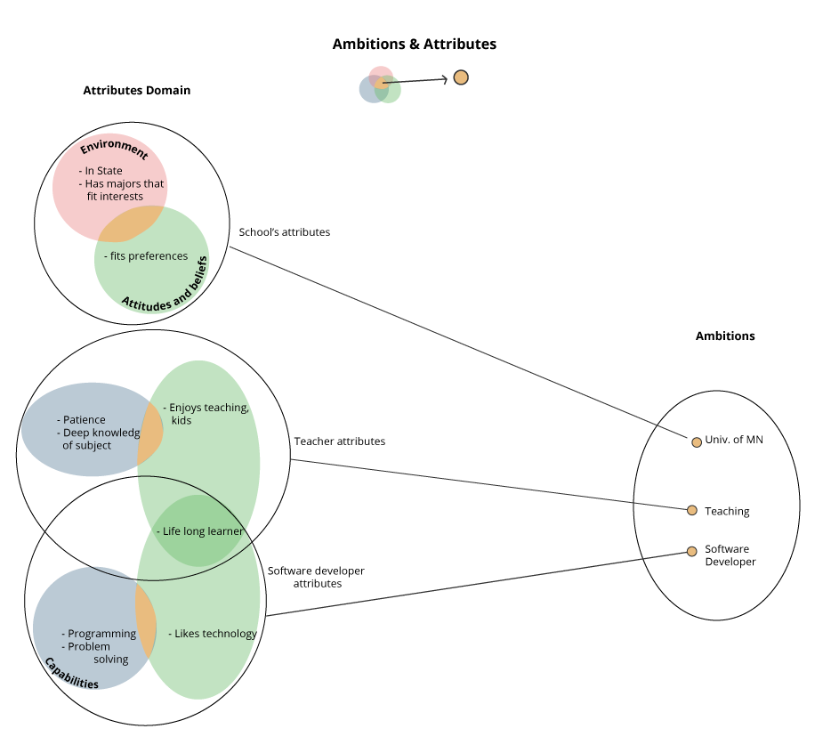

To illustrate this concept with respect to our tool, we can look at a hypothetical student, Ryan, who is using at the Ambition Recommender (Figure 7) to help him make connections between his attributes and ambitions.  He knows that he likes programming and technology, so he has so far only considered a major in Computer Science.  However, when his list of Ambitions is generated, he finds that there is another major, Human Computer Interaction, which aligns better than Computer Science among his interests.

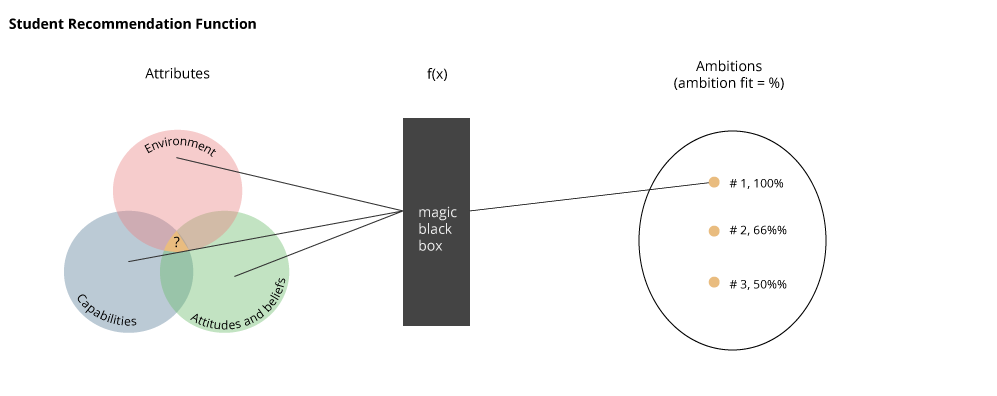

So what happened in that “black box” that was able to make that connection?  Somewhere along the way, Ryan expressed to ACT that he has an interest in Psychology, whether that was suggested by his Interest Inventory results, or explicitly stated when he filled out his Profile for the ACT.  This function was able to pull those separate interests together to provide Ryan with an insight he had never considered before. 

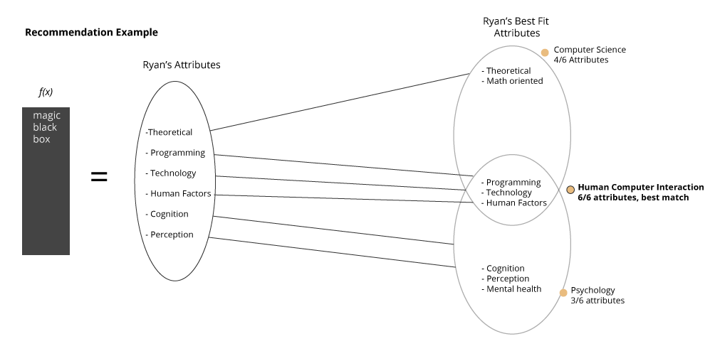

Of course, this example exposes several caveats that are important to account for the accuracy capabilities of the tool.  These caveats are points that ACT can focus on to improve the Ambition Fit:

1. A student must have accurate knowledge about their attributes.
    - If the student does not know their attributes, ACT can rely on other measures besides self-reporting, like the Interest Inventory and Engage results.
    - If the student doesn’t have attributes (i.e. they haven’t provided ACT with any information yet), ACT can intervene and give appropriate context.

2. Students must have accurate knowledge of ambitions.
    - If the student does not know their ambitions, ACT can expose new information about ambition attributes in order to prompt student reflection.
    - If the student doesn’t have ambitions, ACT can provide a place to compare (and therefore evaluate) various ambitions.
  
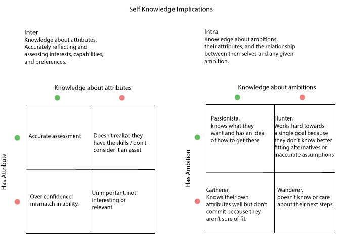

3. Attributes and ambitions are always changing.
    - As the target user for this tool is a high school student, 18 year old ambitions come from an 18 year old sense of self.  Ambition Fit is really a measure for attributes in a point of time.  In order to deliver the most accurate analysis, ACT can promote self-reflection and iteration through an interactive exploratory tool.
    
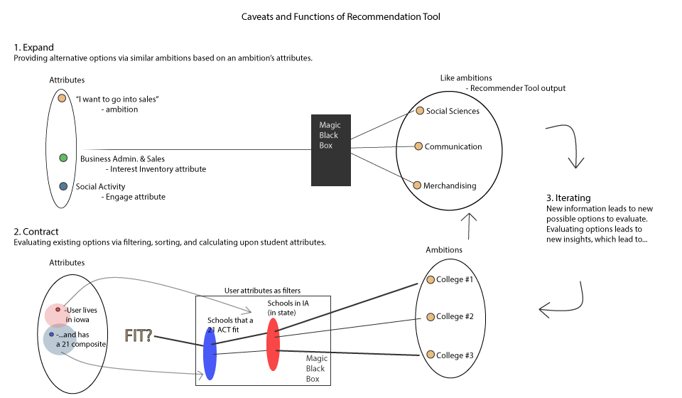

The key takeaways from these caveats are that the two primary purposes of a recommendation fit tool is to **provide alternative options**, and to **evaluate existing options** (see Figure 9).

With this framing, we believe that ACT can support students in their college decision making process through a recommendation tool that can provide new or clarifying information, give estimates of fit via functions, and do so in a way that enables flexibility in catering to student needs.

---
## Data

According to the Buckingham framework (on which the Recommender Tool is scaled), in order for data to enable insights, it must be:
1. Believable
2. Consumable
3. Personally Relevant
4. Novel
5. Actionable

The data was carefully chosen to fulfill those requirements.  In addition to extracting as much preference data from the student test responses, we looked to other sources of information to give context, inform, and incite action on the user's part.

**Integrated Postsecondary Education Data System**, National Center for Education Statistics. Data about majors and institutions. Majors are organized under a taxonomy named CIP, with 3 levels of aggregation; two digits [01, 36, …], four digits [3610], and six digits [361001]. Further, ACT has interest correlations and other attributes from their historical record.

**College Scorecard**, U.S. Department of Education. A dataset about all Title IX funded schools in the United States. The set contains information about majors the school provides, school size, school type (private/public), financial aid information, web URL’s, and much more. For the Recommender tool, the data set was filtered just to the types of degrees available, much more remains to be done.

**Occupational Information Network**, U.S. Department of Labor. A wealth of information on occupations, interests, abilities, and work values. This data provides concrete attributes about jobs, which is the next logical step for ambitions.

---
## Prototype

#### Major Map Rework

Our prototype takes the Major Map Ty Cruce and Krista Mattern developed, and builds upon the interactive demo the intern Rishabh Singh created, which allows users to interact with and see how majors relate to their interests. This visualization aims at answering ‘What do I want to do?’ 

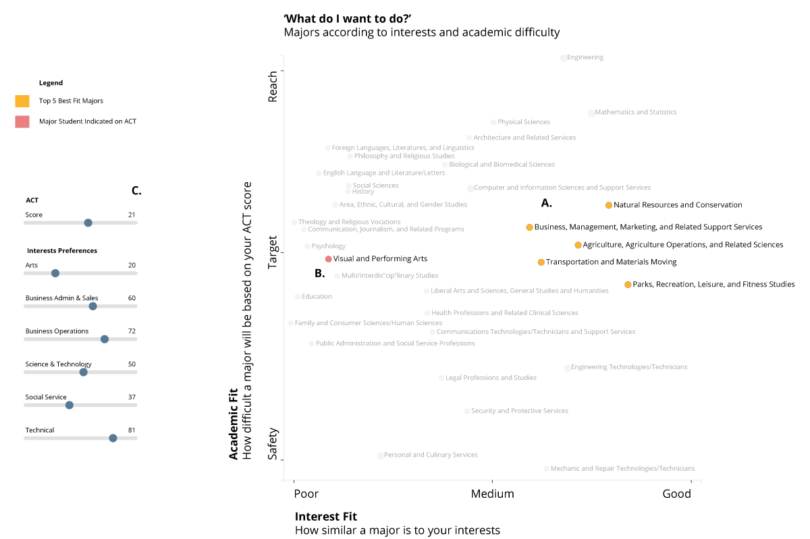

**A. Expanding.** The scatterplot highlights the best majors according to fit by default. Some students may not know all of the options available to them, or are dismissive because of prior assumptions.

**B. Converging.** The graph indicates the major the student expressed interest when signing up for the ACT. This quickly allows the student to evaluate if their intended ambition is worth looking into.

**C. Interaction.** There are two main forms of interaction in the scatterplot; sliders and clicking. The default is to set the sliders to the user values to shorten the orientation period. Each slider affects the majors uniquely, making exploring a delightful experience after initially looking at their scores. Users save majors via clicking, further personalizing the output.

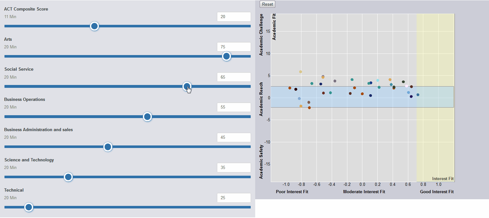

#### Majors to Colleges Sankey

This chart is a novel answer to the student’s question ‘Where can I go?’ It does this by visualizing the relationships between majors and the colleges that have offer each major group. The data behind this is taken from the College Scorecard to get a list of all colleges, their majors, and their attributes. The Scorecard data is then paired with ACT data to make the visualization custom to the user preferences as indicated by their collected information. This first chart comes directly after the Major Map scatterplot. It takes the saved & best fit majors and transitions into a new visualization.

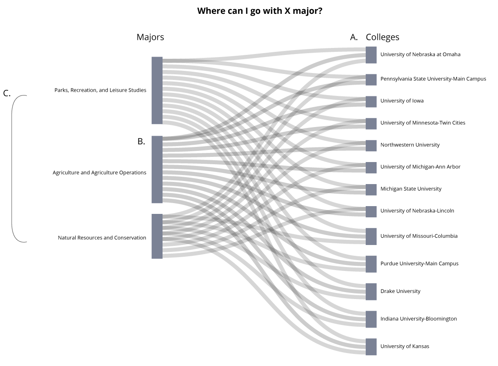

**A. Expanding.** To expose new information to the student, the visualization uses College Scorecard data. The Scorecard data links majors to schools, allowing follow up questions for the user. The purpose is for the student to get an idea of where there options lay when choosing a major.

**B. Converging.** This tool only shows colleges that have the interested major. By default if a college doesn’t have the major, it’s not even shown. The colleges can then be filtered, sorted, and brushed for more relevant results.

**C. Interaction.** This chart is directly fed by the scatterplot, the saved/highlighted majors are then transformed into nodes connecting to colleges. This interaction provides continuity between questions.

#### Colleges to Majors Sankey

The following visualization is an iteration of the previous diagram. This is a proof of concept that identical data can be presented with different emphasis, leading to insights unique to that presentation. The new feature is that we are going the opposite way now, and that both the majors and colleges are placed on the academic scale from the Major Map scatterplot. This gives the student a frame of reference from one chart to another.

**A. Expanding.** To expose new information to the student, the visualization uses Research’s college recommender functions. This provides a lookup for recommended colleges for the user’s location. Further the Research functions include similar colleges for a given college and student. 

**B. Converging.** Colleges are filtered according to student preferences collected from the Score Report, and Profile. While this example only used in-state schools as a filter, more attributes such as school type (private/public), tuition, size, etc are opportunities for future work.

**C. Interaction.** The nodes (blue rectangles) enable highlighting. After clicking either a major or college, the links between nodes change color, and the non-active nodes opacity lowers. Highlighting/brushing is crucial for this visualization as there is so much information. Prudent defaults should be labored over, as anything that is too overwhelming for the user is counter-productive. At the same time, the purpose of this chart is to show all options for a given college ambition, so it will necessarily have a large amount of information

---
## Next Steps

There are a number of opportunities for ACT to support Continuum Reporting. This report will comment on the issues that recurred across departments, prototypes, or concepts we encountered. Because the project drew from so many different sources several themes started to emerge. The commentary will include factors both internal and external of the prototype.

First and foremost; we didn't interact with the users. The whole Continuum Reporting prototype is theoretical, building off of Buckingham and other ACT frameworks. Armed the information from this project, we recommend interviewing users to see which attributes are at a position to best create scenarios. While we incorporated feedback from various prototypes, we never got to sit down with users and get their feedback, which would be invaluable.

Resources were a consistent struggle during the course of the summer. The distributed nature of the project led to a lot of hunting and organizing. ACT would benefit to have a single catalog where information, even entry level, would be an enormous help. In addition to a 'catalog', defined assets such as code samples, color swatches, etc would be a huge step towards consistency. To this end, the Continuum Reporting Project includes code notebooks and data dictionairies. 

Internally, adding a dedicated user interface, more deliberate defaults and functions, and additional data are oppurtunities for the prototype. A dedicated user interface would enable better interaction, something that suffered from a lack of time towards the end. A cohesive interface could transition seamlessly from visualization to visualization, taking student preferences with it and making the experience pleasant to use.

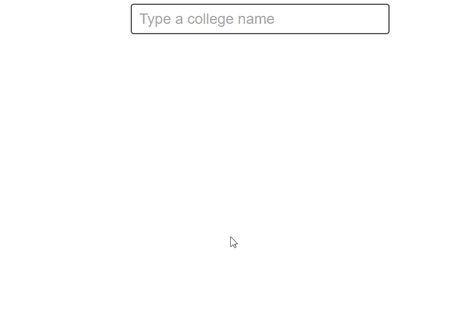</img>

In addition to an emotionally fulfilling interface design, the interactions should be equally fun. Good defaults need to be established to implicitly guide student’s interactions. By default the tool has more information than anyone needs, so it’s up to the creators to preemptively stop information overload. This can be accomplished via interactions and defaults. Therefore it is crucial to plan ahead of time. The current prototype is ‘messier’ than ideal and clearly defining the scope of the visualizations (via defaults, within the charting functions) would have improved the output.

And finally there is always the possibility for new data. It is important to note that ‘new’ data doesn’t mean a fresh dataset that only ACT has access to. This is data that is either new to the user, or presented in a novel way such that it usable to the student. This prototype used Scorecard and ONeT data, but there is a huge opportunity to either blend or combine datasets for new insights. 

---
## Sources

[College Scorecard](https://collegescorecard.ed.gov/data/), by the [U.S. Department of Education](https://www.ed.gov/). School attribute information can be matched to student preferences (school population, etc...) and majors (via CIP codes). 

Both [IPEDS](http://ies.ed.gov/data.asp), by the [Institute of Educational Sciences](http://ies.ed.gov/aboutus/) and [OPED](http://www2.ed.gov/about/offices/list/ope/index.html) by the Office of Postsecondary Education have quasi-unique `ID's` that can be used to match ACT internal `ccodes` to external data.

[ONeT](https://www.onetonline.org/) has information on jobs. Project was restricted from exploring this, but there is likely value in the interests, CIP to SOC (job `ccode`), and work values. 

[What are you going to do with that degree?](http://benschmidt.org/jobs/) by [Ben Schmidt](http://benschmidt.org/). Original inspiration for showing relations between jobs and majors.

[American Community Survey](https://www.census.gov/programs-surveys/acs/) by the [U.S. Census](https://www.census.gov/en.html). The Public Use Microdata Samples (PUMS) have very granular data. We only explored majors and jobs, but there could be more relevant informamtion. 

